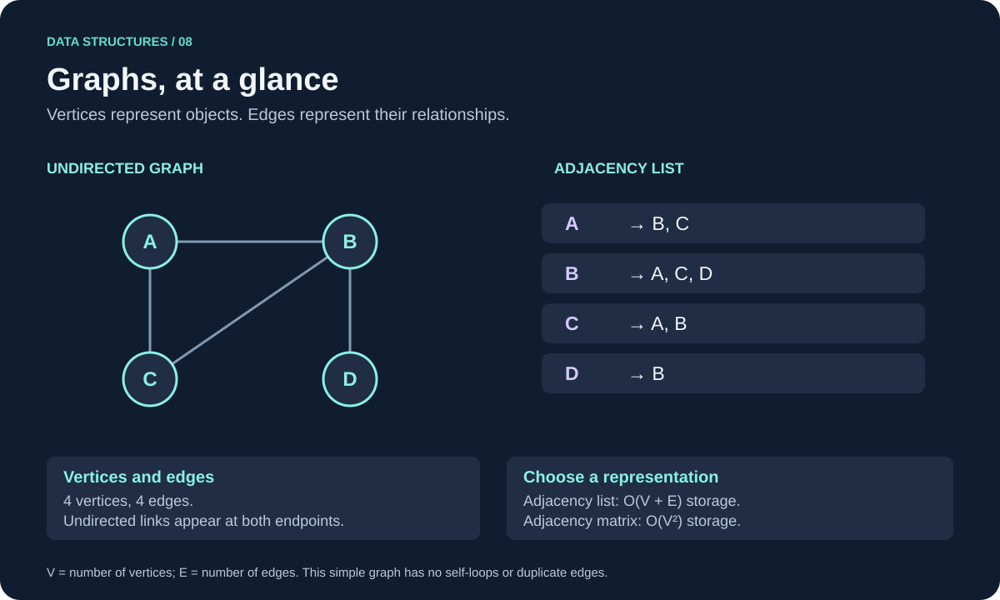

# Graphs

A **graph** represents relationships between objects. The objects are **vertices** (also called nodes), and their connections are **edges**.



```text
0 ─── 1 ─── 3
│     │
└── 2 ┘     4
```

Here, vertices 0, 1, and 2 form a cycle. Vertex 3 is connected to 1. Vertex 4 is isolated. Graphs can contain cycles, disconnected groups, and nodes with many connections.

Examples include cities connected by roads, people connected by friendships, and tasks connected by dependencies.

## Basic Terminology

- **Adjacent vertices:** Two vertices joined by an edge. They are neighbors.
- **Path:** A sequence of vertices connected by edges. For example, 0 → 1 → 3.
- **Cycle:** A route that returns to its starting vertex without repeating other vertices. In the example, 0 → 1 → 2 → 0 is a cycle.
- **Degree:** In an undirected graph, the number of edges incident to a vertex. Without self-loops, this is its number of neighbors.
- **Connected component:** A maximal connected group in an undirected graph: every pair in the group has a path between them.

The example has two connected components: {0, 1, 2, 3} and {4}. An isolated vertex is a component by itself.

We use `V` for the number of vertices and `E` for the number of edges.

## Types of Graphs

### Directed and Undirected

An **undirected** edge connects both ways, like a mutual friendship. A **directed** edge has a direction, like one account following another:

```text
Undirected: A ─── B
Directed:   A ──→ B
```

For directed graphs, **outdegree** counts outgoing edges and **indegree** counts incoming edges. Being able to reach B from A does not imply that A is reachable from B.

Directed graphs distinguish weak connectivity, which ignores directions, from strong connectivity, which requires directed paths both ways between every pair in a group.

### Weighted and Unweighted

A **weighted** graph associates a cost with each edge, such as distance or travel time. An **unweighted** graph treats edges equally.

```text
A ──5── B ──2── C
```

The fewest-edge path is not necessarily the lowest-cost path when weights differ.

### Simple Graphs

A **simple** graph has no self-loops and no multiple edges between the same vertices. Other models allow these features.

The exercises use simple, undirected, unweighted graphs so that basic operations and traversal are easier to follow.

## Graphs and Trees

An undirected tree is a connected graph with no cycles. It has exactly one path between any two vertices. A general graph does not have these restrictions.

Tree traversal can follow child links without revisiting ancestors. Graph traversal needs a way to remember visited vertices, especially around cycles. Even an undirected tree represented with two-way edges needs to avoid walking straight back to the parent.

## Representing a Graph

### Adjacency Matrix

Use a square table. Entry `[u][v]` records whether an edge joins vertices `u` and `v`.

For the opening example:

```text
    0 1 2 3 4
0 [ 0 1 1 0 0 ]
1 [ 1 0 1 1 0 ]
2 [ 1 1 0 0 0 ]
3 [ 0 1 0 0 0 ]
4 [ 0 0 0 0 0 ]
```

An undirected graph has a symmetric matrix: `[u][v]` equals `[v][u]`. In a simple graph, diagonal entries are zero because self-loops are absent.

Checking, adding, or removing an edge takes `O(1)` time. Listing all neighbors of a vertex takes `O(V)` because its row must be scanned. Storage is `O(V²)` even when few edges exist.

For weighted graphs, distinguish an absent edge from a zero-weight edge rather than assuming zero always means “absent.”

### Adjacency List

Store a list of neighbors for each vertex:

```text
0: 1, 2
1: 0, 2, 3
2: 0, 1
3: 1
4: empty
```

An undirected edge appears in both endpoints' lists. The total number of neighbor entries is therefore `2E`, which is still `O(E)`.

Storage is `O(V + E)`. Iterating through one vertex's neighbors takes `O(degree(vertex))`. Checking for an edge in an unsorted neighbor list may require scanning that list.

Lists suit sparse graphs, where edges are few relative to the possible connections. Matrices can be convenient for dense graphs or frequent edge-existence checks.

## Basic Operations

### Add an Edge

For an undirected matrix, set both `[u][v]` and `[v][u]` to 1. Validate vertex indices first, and reject self-loops if the graph is simple.

Adding an existing edge should not create a duplicate or increase an edge count again.

### Remove an Edge

Set both matrix entries to zero. The vertices remain in the graph; removing an edge is different from removing a vertex.

### Check Neighbors and Degree

Scan a vertex's row or neighbor list. In the example, vertex 1 has neighbors 0, 2, and 3, so its degree is 3.

### Add or Remove a Vertex

An adjacency list can add another vertex's list, subject to container growth. Removing a vertex also requires removing its incident edges.

A matrix must provide another row and column when growing beyond its available capacity. Removing a vertex may require clearing or rearranging rows, columns, and vertex IDs. The exercises keep a fixed vertex set and change only edges.

## Breadth-First Search

**Breadth-first search (BFS)** uses a queue. It visits the start vertex, then vertices one edge away, then two edges away, and so on.

1. Mark the start visited and enqueue it.
2. Dequeue a vertex and process it.
3. Mark and enqueue each unvisited neighbor.
4. Repeat until the queue is empty.

Mark a vertex when it is **enqueued**, not later when it is removed. Otherwise, several neighbors might enqueue the same vertex.

From vertex 0 in the example, considering neighbors in ascending order:

```text
Visit order: 0, 1, 2, 3
Distances:  0, 1, 1, 2
Vertex 4:   unreachable
```

BFS gives shortest paths by **number of edges** in an unweighted graph. To reconstruct a path, store the vertex from which each new vertex was discovered. BFS does not generally minimize unequal edge weights.

## Depth-First Search

**Depth-first search (DFS)** follows one path as far as possible before returning to try other paths. It can use recursion or an explicit stack.

Mark a vertex before exploring its neighbors. Skip neighbors that are already visited so cycles do not cause endless traversal.

With ascending neighbor order, recursive DFS from 0 in the example visits:

```text
0 → 1 → 2, back to 1, then 3
Visit order: 0, 1, 2, 3
```

BFS and DFS happen to have the same visit order for this example; they do not in general. Traversal order depends on the start and neighbor ordering. DFS does not guarantee a shortest path.

## Disconnected Graphs

One BFS or DFS from a single start only visits reachable vertices. To visit an entire disconnected graph, loop over all vertices and start a traversal whenever an unvisited vertex is found.

For an undirected graph, each new traversal identifies a connected component. For directed graphs, this procedure alone does not compute strongly connected components.

## Complexity Summary

Assume vertices are numbered 0 through `V - 1` and neighbor lists are unsorted. The traversal bounds describe a full traversal across all components.

| Operation | Adjacency matrix | Adjacency list |
| --- | --- | --- |
| Storage | O(V²) | O(V + E) |
| Check edge from u to v | O(1) | O(degree(u)) |
| Enumerate neighbors of u | O(V) | O(degree(u)) |
| Add an absent edge | O(1) | O(1) with constant-time insertion; duplicate checking may require a scan |
| Remove an edge | O(1) | Requires locating its neighbor entries |
| BFS or DFS | O(V²) | O(V + E) |

For undirected adjacency-list deletion, searching both lists can take `O(degree(u) + degree(v))`. Dynamic-array neighbor lists may also shift elements or occasionally reallocate.

Both traversals use `O(V)` auxiliary space for visited state and a queue or stack. Recursive DFS can reach depth `V` and exhaust the call stack on large graphs. Iterative traversal avoids depending on recursive calls but still needs traversal storage.

## Choosing an Algorithm

Use BFS for minimum-hop routes and level-by-level exploration. Use DFS for exploring structure and as a building block for cycle detection or dependency analysis.

For unequal nonnegative edge weights, Dijkstra's algorithm can find shortest paths; a heap-based priority queue is a common implementation. Negative weights require other approaches, such as Bellman–Ford, and reachable negative cycles can prevent a finite shortest path from existing.

These are different problems from ordinary reachability. Choose the representation and algorithm based on what the edges mean and what answer is needed.

## Language Guides and Practice

- [Graphs in C: examples and exercises](c_graphs.md)
- [Graphs in C++: examples and exercises](cpp_graphs.md)

[Review Queues](../04-queues/README.md) · [Review Trees](../06-trees/README.md) · [Review Heaps](../07-heaps/README.md)
