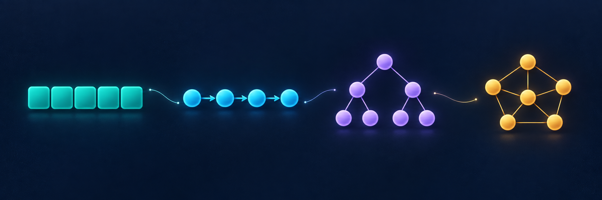

# Data Structures Handbook

Learn how data structures work and how to use them in code. Start with language-agnostic theory, then use the language guides to practice basic operations.

## How to Use This Handbook

1. Start with [Big-O notation](00-complexity-analysis/README.md) to understand time and space complexity.
2. Read a chapter's `README.md` for the structure, its operations, tradeoffs, and complexity.
3. Open a language guide for usage examples and basic exercises. Try the exercises before opening their solutions.

Each chapter keeps language guides alongside its theory README, with no separate exercises directory. For example:

```text
01-arrays/
├── README.md
├── c_arrays.md
├── cpp_arrays.md
└── python_arrays.md
```

## Chapters

| Chapter | Theory | Language guides |
| --- | --- | --- |
| 00 | [Big-O Notation](00-complexity-analysis/README.md) | [C](00-complexity-analysis/c_complexity_analysis.md) · [C++](00-complexity-analysis/cpp_complexity_analysis.md) · [Python](00-complexity-analysis/python_complexity_analysis.md) |
| 01 | [Arrays](01-arrays/README.md) | [C](01-arrays/c_arrays.md) · [C++](01-arrays/cpp_arrays.md) · [Python](01-arrays/python_arrays.md) |
| 02 | [Linked Lists](02-linked-lists/README.md) | [C](02-linked-lists/c_linked_lists.md) · [C++](02-linked-lists/cpp_linked_lists.md) |
| 03 | [Stacks](03-stacks/README.md) | [C](03-stacks/c_stacks.md) · [C++](03-stacks/cpp_stacks.md) |
| 04 | [Queues](04-queues/README.md) | [C](04-queues/c_queues.md) · [C++](04-queues/cpp_queues.md) |
| 05 | [Hash Tables](05-hash-tables/README.md) | [C](05-hash-tables/c_hash_tables.md) · [C++](05-hash-tables/cpp_hash_tables.md) |
| 06 | [Trees](06-trees/README.md) | [C](06-trees/c_trees.md) · [C++](06-trees/cpp_trees.md) |
| 07 | [Heaps](07-heaps/README.md) | [C](07-heaps/c_heaps.md) · [C++](07-heaps/cpp_heaps.md) |
| 08 | [Graphs](08-graphs/README.md) | [C](08-graphs/c_graphs.md) · [C++](08-graphs/cpp_graphs.md) |

## Algorithms

Algorithm topics are organized into language-specific lessons, each with a worked example, infographic, implementation, complexity analysis, and exercises with hidden solutions. Explanations live directly in each language file; there is no separate topic README. C++17 lessons are currently available, with other languages planned.

- [Prefix Sums](algorithms/00-prefix_sum/cpp_prefix_sum.md)
- [Two Pointers](algorithms/01-two_pointers/cpp_two_pointers.md)
- [Sliding Windows](algorithms/02-sliding_window/cpp_sliding_window.md)
- [Fast and Slow Pointers](algorithms/03-fast_and_slow_pointers/cpp_fast_and_slow_pointers.md)
- [Binary Search](algorithms/04-binary_search/cpp_binary_search.md)
- [Top K Elements](algorithms/05-top_k_elements/cpp_top_k_elements.md)
- [Matrix Traversal](algorithms/06-matrix_traversal/cpp_matrix_traversal.md)
- [Binary Tree Traversal](algorithms/07-binary_tree_traversal/cpp_binary_tree_traversal.md)
- [Depth-First Search (DFS)](algorithms/08-depth_first_search_dfs/cpp_depth_first_search_dfs.md)
- [Breadth-First Search (BFS)](algorithms/09-breadth_first_search_bfs/cpp_breadth_first_search_bfs.md)
- [Backtracking](algorithms/10-backtracking/cpp_backtracking.md)
