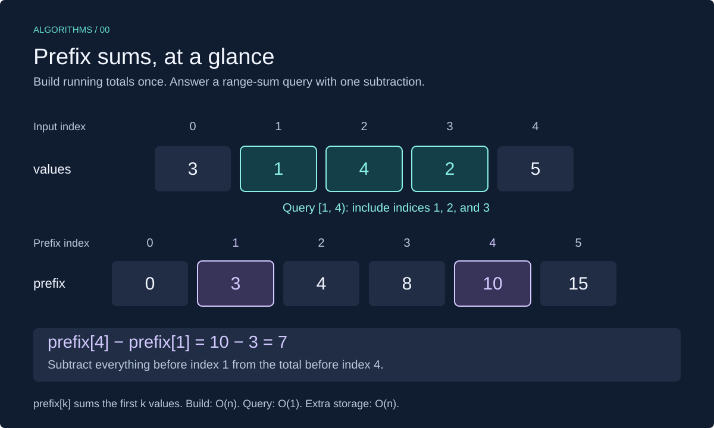

# Prefix Sums in C++

A **prefix sum** stores the total of the elements before a position. Build these totals once, then find the sum of any contiguous range with one subtraction.



This lesson uses C++17 and `std::vector`. Review [arrays in C++](../../01-arrays/cpp_arrays.md) if indexing or vectors are new to you.

## When to Use It

Use prefix sums when you need **many range-sum queries on values that do not change**. Examples include totals across a range of days or scores between two positions.

Without preprocessing, each query adds the requested elements one by one. For `q` queries over `n` elements, that can take O(q × n) time. Prefix sums reduce the total to O(n + q), using O(n) extra storage.

- Values can be positive, negative, or zero; the array does not need to be sorted.
- For just one query, adding the range directly is usually simpler.
- Changing a value makes later prefix totals stale. Frequent updates call for another approach; this lesson assumes the values stay unchanged between queries.

## Build One Extra Element

For `n` input values, create `n + 1` prefix totals:

- `prefix[0] = 0`: the sum of no elements.
- `prefix[i + 1] = prefix[i] + values[i]`.
- `prefix[k]` is the sum of the **first `k` values**, excluding index `k`.

For `values = [3, 1, 4, 2, 5]`:

| Input index `i` | Value | Calculation | New prefix total |
| --- | --- | --- | --- |
| — | — | Start with an empty prefix | `prefix[0] = 0` |
| 0 | 3 | `0 + 3` | `prefix[1] = 3` |
| 1 | 1 | `3 + 1` | `prefix[2] = 4` |
| 2 | 4 | `4 + 4` | `prefix[3] = 8` |
| 3 | 2 | `8 + 2` | `prefix[4] = 10` |
| 4 | 5 | `10 + 5` | `prefix[5] = 15` |

```text
values: [3, 1, 4,  2,  5]
prefix: [0, 3, 4, 8, 10, 15]
```

## Query a Range with Subtraction

This guide uses **half-open ranges** `[left, right)`: include `left`, exclude `right`.

```text
range sum = prefix[right] - prefix[left]
```

To add input indices 1 through 3, query `[1, 4)`:

```text
prefix[4] = 3 + 1 + 4 + 2 = 10
prefix[1] = 3             =  3
                           ──
Difference =   1 + 4 + 2 =  7
```

The subtraction removes everything before `left`. The leading zero handles ranges starting at index zero without a special case.

| Query | Meaning | Result |
| --- | --- | --- |
| `[1, 4)` | Values at indices 1, 2, 3 | `10 - 3 = 7` |
| `[0, 5)` | All values | `15 - 0 = 15` |
| `[2, 3)` | Only index 2 | `8 - 4 = 4` |
| `[3, 3)` | Empty range | `8 - 8 = 0` |

For an **inclusive** input range `[left, right]`, use `prefix[right + 1] - prefix[left]` instead. Do not mix the two conventions.

## C++ Implementation

The following is a complete program. The two helper functions are reused in the exercises.

```cpp
#include <cstddef>
#include <iostream>
#include <stdexcept>
#include <vector>

std::vector<long long> build_prefix(const std::vector<int>& values) {
    std::vector<long long> prefix(values.size() + 1, 0);
    for (std::size_t i = 0; i < values.size(); ++i) {
        prefix[i + 1] = prefix[i] + values[i];
    }
    return prefix;
}

long long range_sum(const std::vector<long long>& prefix,
                    std::size_t left, std::size_t right) {
    if (prefix.empty() || left > right || right >= prefix.size()) {
        throw std::out_of_range("Invalid prefix-sum range");
    }
    return prefix[right] - prefix[left];
}

int main() {
    const std::vector<int> values = {3, 1, 4, 2, 5};
    const auto prefix = build_prefix(values);

    std::cout << range_sum(prefix, 1, 4) << "\n"; // 7
    std::cout << range_sum(prefix, 0, 5) << "\n"; // 15
    std::cout << range_sum(prefix, 3, 3) << "\n"; // 0
}
```

### Implementation Details

- **`const std::vector<int>&`:** reads the input without copying or changing it.
- **`std::vector<long long>`:** keeps totals in a wider integer type than `int`. Assume all prefix totals and query differences fit in `long long`; it can still overflow. Also assume space is available for `n + 1` elements.
- **`std::size_t`:** matches vector sizes and indices. It is unsigned; validate signed user input before converting it, and avoid subtracting one from zero.
- **`n + 1` initialized elements:** the vector constructor creates real elements. `reserve(n + 1)` alone would only allocate capacity and would not make indexing valid.
- **Bounds:** valid queries satisfy `0 <= left <= right <= n`. Because the prefix vector has `n + 1` elements, `right == n` is valid. Invalid ranges throw `std::out_of_range`.

Pass a prefix vector produced by `build_prefix` to `range_sum`; the query helper checks bounds, not whether the supplied totals are correct. An empty input produces `{0}`, so its only valid query, `[0, 0)`, returns zero.

## Complexity

| Operation | Time | Extra storage |
| --- | --- | --- |
| Build prefix totals | O(n) | O(n) for the prefix vector |
| Query one range | O(1) | O(1) |
| Build once and answer `q` queries | O(n + q) | O(n), excluding stored query results |

Each construction step adds one value. Each query reads two totals and subtracts them. Rebuilding the prefix vector for every query would lose the benefit.

## Common Mistakes

- **Leaving out the leading zero:** keep `n + 1` totals so ranges starting at zero use the same formula.
- **Confusing inclusive and exclusive endpoints:** `[1, 4)` includes index 3, not index 4.
- **Using `int` for large totals:** widening only the final answer does not fix overflow that already happened while building the totals.
- **Changing the input without rebuilding:** the prefix vector is a snapshot, not a live view of the original values.
- **Subtracting in the wrong order:** take the total before `right` minus the total before `left`.

## Exercises

Try each exercise before opening its solution. For code exercises, reuse the helpers and headers above, but replace `main` as needed. Assume totals and differences fit in `long long`.

### Exercise 1: Build and Trace

For `values = [2, -1, 3, 0, 4]`, write the complete prefix vector. Then find the sums of `[1, 4)`, `[0, 5)`, and `[2, 2)`.

<details>
<summary>Show solution</summary>

```text
prefix = [0, 2, 1, 4, 4, 8]

[1, 4): prefix[4] - prefix[1] = 4 - 2 = 2
[0, 5): prefix[5] - prefix[0] = 8 - 0 = 8
[2, 2): prefix[2] - prefix[2] = 1 - 1 = 0
```

Negative values work because the same earlier prefix is subtracted from both sides. Prefix totals do not have to increase.

**Complexity:** O(n) to build; O(1) per query.

</details>

### Exercise 2: Answer Several Queries

Build prefix totals once for `[5, 2, -3, 6]`. Print the sums of `[0, 2)`, `[1, 4)`, and `[0, 0)` using `range_sum`.

<details>
<summary>Show solution</summary>

```cpp
int main() {
    const std::vector<int> values = {5, 2, -3, 6};
    const auto prefix = build_prefix(values);
    std::cout << range_sum(prefix, 0, 2) << "\n"; // 7
    std::cout << range_sum(prefix, 1, 4) << "\n"; // 5
    std::cout << range_sum(prefix, 0, 0) << "\n"; // 0
}
```

The prefix vector is `[0, 5, 7, 4, 10]`. All queries reuse it.

**Complexity:** O(n + q) time for `q` queries and O(n) extra storage.

</details>

### Exercise 3: Count Even Values in a Range

Write `build_even_prefix(values)` so a query returns how many even values lie in a range. Treat each even value as 1 and each odd value as 0. Reuse `range_sum` to query the result.

For `[3, 8, 2, 7, 0]`, query `[1, 5)` should return `3`. Zero and negative even integers count as even.

<details>
<summary>Show solution</summary>

```cpp
std::vector<long long> build_even_prefix(const std::vector<int>& values) {
    std::vector<long long> prefix(values.size() + 1, 0);
    for (std::size_t i = 0; i < values.size(); ++i) {
        const int is_even = (values[i] % 2 == 0) ? 1 : 0;
        prefix[i + 1] = prefix[i] + is_even;
    }
    return prefix;
}
```

The transformed values are `[0, 1, 1, 0, 1]`, giving prefix totals `[0, 0, 1, 2, 2, 3]`. The answer is `prefix[5] - prefix[1] = 3`.

**Complexity:** O(n) to build, O(1) per query, and O(n) prefix storage.

</details>

### Exercise 4: Recover the Original Values

Given valid prefix totals `[0, 4, 3, 9]`, recover the input. What general formula gives the value at index `i`?

<details>
<summary>Show solution</summary>

```text
values[i] = prefix[i + 1] - prefix[i]

4 - 0 = 4
3 - 4 = -1
9 - 3 = 6

values = [4, -1, 6]
```

Two neighboring totals differ by exactly the one value added between them.

**Complexity:** O(n) to recover every value, with O(n) storage if saving the result.

</details>

[Review Arrays](../../01-arrays/README.md) · [Review Big-O Notation](../../00-complexity-analysis/README.md)
