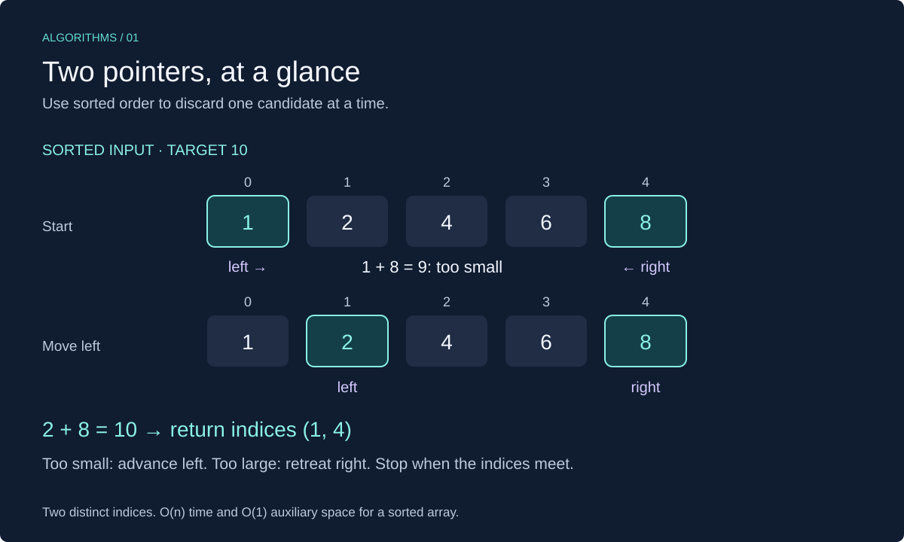

# Two Pointers in C++

**Two pointers** means keeping track of two positions and moving them according to a rule. Here, pointers are array indices, not C++ raw pointers. A good movement rule avoids checking every pair of elements.



This lesson uses C++17. Review [arrays in C++](../../01-arrays/cpp_arrays.md) for vectors and indexing.

## When to Use It

Use this technique when the ordering or structure of the problem tells you which position can move without missing an answer.

- **Opposite ends:** search for a pair with a target sum in a sorted array, or reverse a sequence.
- **Same direction:** use a read index to inspect values and a write index to keep selected values in place.

Two indices alone do not make an algorithm linear. The key is that each moves through the input at most once, with constant work per movement.

Our main example finds **one pair of distinct indices** whose values sum to a target. It requires ascending, nondecreasing input; duplicate values are allowed. It does not require positive values.

## Worked Example: Find a Pair

For **`[1, 2, 4, 6, 8]` and target `10`**, start at the first and last elements:

| Left index | Right index | Sum | Action |
| --- | --- | --- | --- |
| 0 | 4 | `1 + 8 = 9` | Too small: move left rightward |
| 1 | 4 | `2 + 8 = 10` | Found `(1, 4)` |

For target `7` on the same array:

| Left index | Right index | Sum | Action |
| --- | --- | --- | --- |
| 0 | 4 | `1 + 8 = 9` | Too large: move right leftward |
| 0 | 3 | `1 + 6 = 7` | Found `(0, 3)` |

### Why Moving One Side Is Safe

- If the sum is **too small**, the left value cannot work with any remaining right value: every other candidate is no larger. Discard that left position.
- If the sum is **too large**, the right value cannot work with any remaining left value: every other candidate is no smaller. Discard that right position.
- If the sum matches, return the pair.

Stop when the indices meet. An element cannot pair with itself. These arguments depend on sorted input; using the same rules on an unsorted array can miss valid pairs.

## C++ Implementation

```cpp
#include <cstddef>
#include <iostream>
#include <optional>
#include <utility>
#include <vector>

std::optional<std::pair<std::size_t, std::size_t>> find_pair(
    const std::vector<int>& values, long long target) {
    if (values.size() < 2) {
        return std::nullopt;
    }

    std::size_t left = 0;
    std::size_t right = values.size() - 1;
    while (left < right) {
        const long long sum = static_cast<long long>(values[left]) + values[right];
        if (sum == target) {
            return std::make_pair(left, right);
        }
        if (sum < target) {
            ++left;
        } else {
            --right;
        }
    }
    return std::nullopt;
}

int main() {
    const std::vector<int> values = {1, 2, 4, 6, 8};
    const auto result = find_pair(values, 10);
    if (result) {
        std::cout << result->first << ", " << result->second << "\n"; // 1, 4
    } else {
        std::cout << "No pair\n";
    }
}
```

### Implementation Details

- **Sorted input is a precondition:** the function neither sorts nor checks ordering. Sorting an unsorted input costs O(n log n) and changes its indices; preserve original positions separately if you need them.
- **`std::optional` from `<optional>`:** contains a pair on success or `std::nullopt` on failure. Check it before accessing the result.
- **Guard before subtracting:** `std::size_t` is unsigned, so subtracting one from an empty vector's size would wrap around.
- **Widen before addition:** the cast converts the first operand to `long long` before the values are added. Casting an already-overflowed `int` sum would be too late. Assume pair sums fit in `long long`.
- **No input copy:** the const reference keeps the original vector unchanged.

The `left < right` condition makes the two indices distinct and ensures decrementing `right` cannot wrap below zero.

## Complexity

| Approach | Time | Auxiliary space |
| --- | --- | --- |
| Try every distinct pair | O(n²) | O(1) |
| Two pointers on sorted input | O(n) | O(1) |

Each unsuccessful iteration shortens the candidate range by one. There are at most `n - 1` comparisons of pairs. Returning the first match can finish sooner.

## Common Mistakes

- Applying the sorted-pair rule to an unsorted array.
- Moving the wrong side: a small sum moves `left`; a large sum moves `right`.
- Using `left <= right`, which can reuse one element twice.
- Computing `size() - 1` before handling empty input.
- Promising every pair: this implementation returns only one pair, not all pairs or a count.

## Exercises

Try each exercise before opening its solution. Reuse the headers above. Exercise functions can be added before `main`; replace `main` when trying another complete example.

### Exercise 1: Trace a Failed Search

Trace `find_pair([1, 3, 5, 8], 10)`. Which pairs are checked?

<details>
<summary>Show solution</summary>

```text
1 + 8 = 9  → move left
3 + 8 = 11 → move right
3 + 5 = 8  → move left
Indices meet → no pair
```

The function returns `std::nullopt`. It never checks an index against itself.

**Complexity:** O(n) time and O(1) auxiliary space.

</details>

### Exercise 2: Reverse in Place

Write `reverse_values(values)` using indices at opposite ends. Do not create a second vector. Empty and one-element vectors should remain unchanged.

<details>
<summary>Show solution</summary>

```cpp
void reverse_values(std::vector<int>& values) {
    if (values.size() < 2) return;
    std::size_t left = 0;
    std::size_t right = values.size() - 1;
    while (left < right) {
        std::swap(values[left], values[right]);
        ++left;
        --right;
    }
}
```

Each swap puts both outer values in their final positions. Sorted input is unnecessary for reversal: its movement rule solves a different problem.

**Complexity:** O(n) time and O(1) auxiliary space.

</details>

### Exercise 3: Keep Nonzero Values in Place

Write `keep_nonzero(values)` to move nonzero values to the front, preserving their order, and return the logical length. Do not resize the vector.

For `[0, 4, 0, -2, 7]`, return `3`; the first three elements must become `[4, -2, 7]`. Ignore values after the returned length.

<details>
<summary>Show solution</summary>

```cpp
std::size_t keep_nonzero(std::vector<int>& values) {
    std::size_t write = 0;
    for (std::size_t read = 0; read < values.size(); ++read) {
        if (values[read] != 0) {
            values[write] = values[read];
            ++write;
        }
    }
    return write;
}
```

The read index inspects every value; the write index marks the next kept position. Since `write <= read`, writing never destroys unread input. The vector's physical size stays unchanged.

**Complexity:** O(n) time and O(1) auxiliary space.

</details>

### Exercise 4: Duplicates and Short Inputs

What should the pair search return for these inputs?

- `[]`, target `6`
- `[3]`, target `6`
- `[3, 3]`, target `6`
- `[-5, -1, 2, 6]`, target `1`

<details>
<summary>Show solution</summary>

The first two return no pair. `[3, 3]` returns `(0, 1)`: equal values at distinct positions are allowed. The last input returns `(0, 3)`, because `-5 + 6 = 1`.

Negative numbers do not break the sorted-order argument.

</details>

[Review Arrays](../../01-arrays/cpp_arrays.md) · [Next: Sliding Window](../02-sliding_window/cpp_sliding_window.md)
