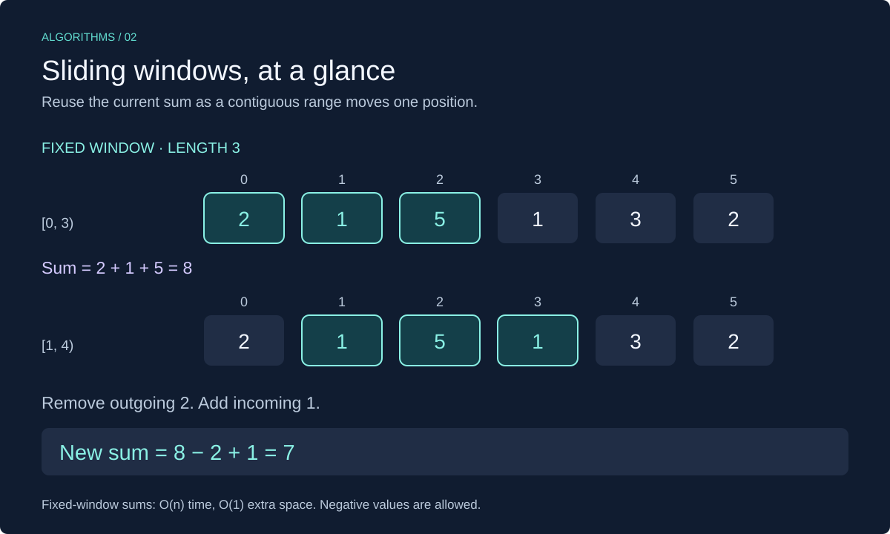

# Sliding Windows in C++

A **sliding window** is a contiguous range that moves through a sequence. Reuse information about the current range instead of recalculating everything whenever its boundaries move.



This lesson uses C++17 and `std::vector`. Review [two pointers](../01-two_pointers/cpp_two_pointers.md) for moving indices and [prefix sums](../00-prefix_sum/cpp_prefix_sum.md) for arbitrary range-sum queries.

## When to Use It

Look for a problem about **contiguous subarrays or substrings** where adding and removing boundary elements is cheap.

- **Fixed window:** inspect every range of exactly `k` elements, such as the best total over three consecutive days.
- **Variable window:** expand or shrink a range to maintain a condition, such as a sum no greater than a limit when all values are nonnegative.

A subsequence that skips positions is not a contiguous window. Also, not every condition supports safe shrinking: the movement rule needs a reason why discarded candidates cannot be better.

For arbitrary range queries, prefix sums are often a better fit. For every consecutive range of the same length, a running window sum needs only O(1) extra space.

## Fixed Window: Maximum Sum of `k` Values

For `[2, 1, 5, 1, 3, 2]` and `k = 3`, compute the first sum. Then subtract the value leaving the window and add the one entering it.

This guide uses half-open ranges `[left, right)`: include `left`, exclude `right`.

| Window | Values | Sum calculation | Best so far |
| --- | --- | --- | --- |
| `[0, 3)` | `[2, 1, 5]` | `2 + 1 + 5 = 8` | 8 |
| `[1, 4)` | `[1, 5, 1]` | `8 - 2 + 1 = 7` | 8 |
| `[2, 5)` | `[5, 1, 3]` | `7 - 1 + 3 = 9` | 9 |
| `[3, 6)` | `[1, 3, 2]` | `9 - 5 + 2 = 6` | 9 |

The maximum sum is `9`. Fixed-window sums work with negative values too; moving the window does not depend on whether its sum increases or decreases.

## C++ Implementation: Fixed Window

```cpp
#include <cstddef>
#include <iostream>
#include <optional>
#include <vector>

std::optional<long long> max_window_sum(const std::vector<int>& values,
                                       std::size_t k) {
    if (k == 0 || k > values.size()) {
        return std::nullopt;
    }

    long long sum = 0;
    for (std::size_t i = 0; i < k; ++i) {
        sum += values[i];
    }
    long long best = sum;

    for (std::size_t right = k; right < values.size(); ++right) {
        sum -= values[right - k];
        sum += values[right];
        if (sum > best) best = sum;
    }
    return best;
}

int main() {
    const std::vector<int> values = {2, 1, 5, 1, 3, 2};
    const auto result = max_window_sum(values, 3);
    if (result) {
        std::cout << *result << "\n"; // 9
    } else {
        std::cout << "Invalid window size\n";
    }
}
```

### Implementation Details

- The function requires `1 <= k <= values.size()`. Empty input, zero length, and oversized windows return `std::nullopt`.
- Initialize `best` from the first real window, not zero. All valid window sums could be negative.
- `right` identifies the next entering element; `right - k` identifies the outgoing element. The loop starts at `k`, preventing unsigned subtraction from wrapping.
- `long long` stores the running total. Assume every intermediate sum fits in it; a wider type is not an unlimited type.
- A const reference avoids copying or changing the input. The algorithm stores only a few indices and totals.

## Variable Window: Longest Sum at Most a Limit

Now let the length change. Find the longest contiguous range whose sum is at most `limit`, assuming **all input values and the limit are nonnegative**.

1. Add the next value on the right.
2. While the sum exceeds the limit, remove values from the left.
3. Record the valid window's length.

For `[2, 1, 3, 1, 1]` with limit `4`:

| Add index | Shrink if needed | Valid window | Best length |
| --- | --- | --- | --- |
| 0 | None | `[2]`, sum 2 | 1 |
| 1 | None | `[2, 1]`, sum 3 | 2 |
| 2 | Remove 2 | `[1, 3]`, sum 4 | 2 |
| 3 | Remove 1 | `[3, 1]`, sum 4 | 2 |
| 4 | Remove 3 | `[1, 1]`, sum 2 | 2 |

### Why the Nonnegative Requirement Matters

With nonnegative values, extending a window cannot decrease its sum, and removing a leftmost value cannot increase it. Once a left boundary is invalid for a right endpoint, extending further cannot make that same boundary valid again.

With negatives, this fails. For `[5, -4]` and limit `3`, the whole array has sum `1`. A rule that immediately discards `5` before seeing `-4` misses that valid length-two range. Do not use this shrinking rule for negative input.

## C++ Implementation: Variable Window

Add `<stdexcept>` for the exceptions used here. This function can be placed before `main` in the preceding program.

```cpp
#include <stdexcept>

std::size_t longest_sum_at_most(const std::vector<int>& values,
                               long long limit) {
    if (limit < 0) throw std::invalid_argument("Limit must be nonnegative");
    for (int value : values) {
        if (value < 0) throw std::invalid_argument("Values must be nonnegative");
    }

    std::size_t left = 0;
    std::size_t best = 0;
    long long sum = 0;
    for (std::size_t right = 0; right < values.size(); ++right) {
        sum += values[right];
        while (sum > limit) {
            sum -= values[left];
            ++left;
        }
        // right is included; right + 1 is the exclusive endpoint.
        const std::size_t length = (right + 1) - left;
        if (length > best) best = length;
    }
    return best;
}
```

Assume intermediate sums fit in `long long`. The input validation is O(n) and keeps the function's contract explicit. A value larger than the limit can leave the current window empty; `(right + 1) - left` then gives zero. Empty input returns zero. Zero-valued elements are valid and can extend a window without changing its sum.

## Complexity

| Approach | Time | Auxiliary space |
| --- | --- | --- |
| Recompute all length-`k` window sums | O((n - k + 1) × k) for valid `k` | O(1) |
| Fixed running-sum window | O(n) | O(1) |
| Variable window above, including validation | O(n) | O(1) |

The variable-window code contains a nested loop, but `left` only moves forward. Across the whole run, each value enters once and leaves at most once. The total work is linear, not quadratic.

## Common Mistakes

- Forgetting to remove the outgoing value when moving a fixed window.
- Starting the maximum at zero when negative answers are possible.
- Using `if` instead of `while` when several left values may need to leave.
- Applying the nonnegative sum rule to arrays containing negatives.
- Recomputing the entire window after every move, losing the O(n) benefit.

## Exercises

Try each exercise before opening its solution. Reuse the helpers and headers above. Use a separate `main` for each complete program.

### Exercise 1: All-Negative Input

What does `max_window_sum([-4, -2, -7, -1], 2)` return? What would go wrong if `best` started at zero?

<details>
<summary>Show solution</summary>

The window sums are `-6`, `-9`, and `-8`, so the answer is `-6`. Starting at zero would return a total that no valid window has.

**Complexity:** O(n) time and O(1) auxiliary space.

</details>

### Exercise 2: Maximum Average

Write `max_window_average(values, k)` using `max_window_sum`. Return an empty optional for an invalid length.

For `[2, 1, 5, 1, 3, 2]` and `k = 3`, return `3.0`.

<details>
<summary>Show solution</summary>

```cpp
std::optional<double> max_window_average(const std::vector<int>& values,
                                         std::size_t k) {
    const auto best = max_window_sum(values, k);
    if (!best) return std::nullopt;
    return static_cast<double>(*best) / static_cast<double>(k);
}
```

All candidate windows have the same positive length, so the greatest sum also has the greatest average. Convert before division to avoid integer truncation. Floating-point results may be rounded.

**Complexity:** O(n) time and O(1) auxiliary space.

</details>

### Exercise 3: Shrink More Than Once

Trace `longest_sum_at_most([1, 1, 1, 5], 3)`. What happens when 5 enters?

<details>
<summary>Show solution</summary>

The first three values form a window of length 3 and sum 3. Adding 5 makes the sum 8. Remove the three ones, then remove 5 itself. The current window becomes empty with sum zero. The best length remains `3`.

A single `if` would remove only one value and leave an invalid window.

**Complexity:** O(n) overall: each value leaves at most once.

</details>

### Exercise 4: Boundary Cases

Predict the results:

- `max_window_sum([], 1)`
- `max_window_sum([4, 2], 0)`
- `max_window_sum([4, 2], 2)`
- `longest_sum_at_most([0, 0, 1, 0], 0)`
- `longest_sum_at_most([5, -4], 3)`

<details>
<summary>Show solution</summary>

The first two return `std::nullopt`. The third returns `6`. The fourth returns `2`, from the two leading zeros. The fifth throws `std::invalid_argument` because this variable-window implementation requires nonnegative values.

</details>

[Review Two Pointers](../01-two_pointers/cpp_two_pointers.md) · [Review Prefix Sums](../00-prefix_sum/cpp_prefix_sum.md)
