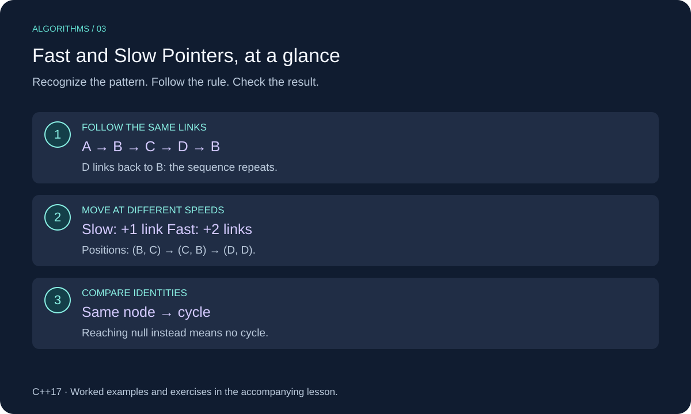

# Fast and Slow Pointers in C++

Two positions follow the same sequence at different speeds. In a linked list, a slow pointer moves one link per iteration while a fast pointer moves two. This lets us detect a cycle without storing every visited node.



This lesson uses C++17. Review [Linked Lists](../../02-linked-lists/cpp_linked_lists.md) for the underlying structure or technique.

## When to Use It

Use this technique when repeatedly following one successor, such as the `next` link in a singly linked list. Here we implement Floyd's cycle detection: return whether following links eventually revisits a node.

An ordinary graph can offer several outgoing edges, so this is not a general graph cycle detector. The list must stay unchanged during the search, and every non-null pointer must refer to a live node.

## Worked Example

Consider `A → B → C → D → B`, where D links back to B:

| Iteration | Slow | Fast |
| --- | --- | --- |
| Start | A | A |
| 1 | B | C |
| 2 | C | B |
| 3 | D | D: cycle detected |

Compare after moving: equality at the starting node does not prove a cycle. If fast reaches the end, there is no cycle.

Inside a cycle of length `c`, fast gains one position per iteration relative to slow. Their relative distance changes by one modulo `c`, so they meet within at most `c` more iterations.

## C++ Implementation

```cpp
#include <iostream>

struct Node {
    int value;
    Node* next = nullptr;
};

bool has_cycle(const Node* head) {
    const Node* slow = head;
    const Node* fast = head;
    while (fast != nullptr && fast->next != nullptr) {
        slow = slow->next;
        fast = fast->next->next;
        if (slow == fast) return true;
    }
    return false;
}

int main() {
    Node a{10}, b{20}, c{30}, d{40};
    a.next = &b;
    b.next = &c;
    c.next = &d;
    d.next = &b;
    std::cout << std::boolalpha << has_cycle(&a) << "\n"; // true
    d.next = nullptr;
    std::cout << has_cycle(&a) << "\n"; // false
}
```

## Implementation Details

`&&` short-circuits: C++ checks `fast` before reading `fast->next`. The second guard makes the two-link jump safe. Compare node addresses, not values: separate nodes can hold equal values.

The function borrows nodes and neither allocates nor frees them. The example uses local nodes, so no `delete` is needed. `nullptr` input returns false. A node pointing to itself returns true.

## Complexity

O(n) time and O(1) auxiliary space, where `n` counts distinct reachable nodes. No visited set is needed.

## Common Mistakes

- Comparing values instead of node identities.
- Comparing the initial positions before moving.
- Reading `fast->next->next` without both null checks.
- Trying to clear a cyclic list by following links until null; it never ends.

## Exercises

Try each exercise before opening its solution. Reuse the definitions and headers above; place exercise helpers before `main`.

### Exercise 1: Trace an Acyclic List

Trace `A → B → C → D → null`.

<details>
<summary>Show solution</summary>

After one iteration: slow B, fast C. After two: slow C, fast null. The loop stops and returns false. The null guard also handles an empty list.

</details>

### Exercise 2: Find the Middle

For an acyclic list, write a helper returning its middle node. Return the second middle when the length is even.

<details>
<summary>Show solution</summary>

```cpp
const Node* middle(const Node* head) {
    const Node* slow = head;
    const Node* fast = head;
    while (fast != nullptr && fast->next != nullptr) {
        slow = slow->next;
        fast = fast->next->next;
    }
    return slow;
}
```

For four nodes, slow ends at the third. Empty input returns null. This helper requires an acyclic list. O(n) time and O(1) auxiliary space.

</details>

### Exercise 3: Equal Values

Does `7 → 7 → null` contain a cycle? What about one node whose next points to itself?

<details>
<summary>Show solution</summary>

The first has no cycle: equal values do not imply the same node. The self-linked node has a cycle of length one.

</details>

[Review Linked Lists](../../02-linked-lists/cpp_linked_lists.md)
